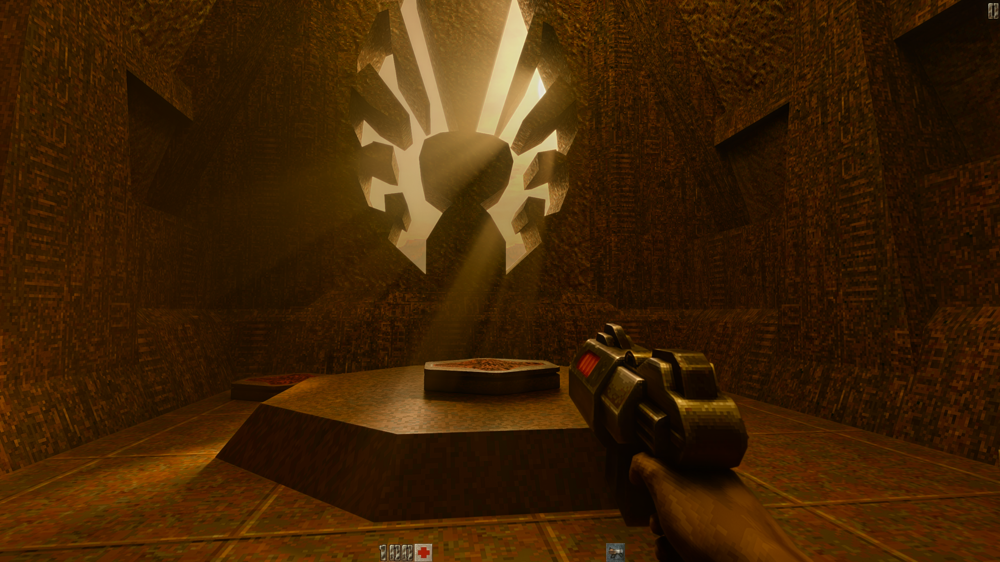
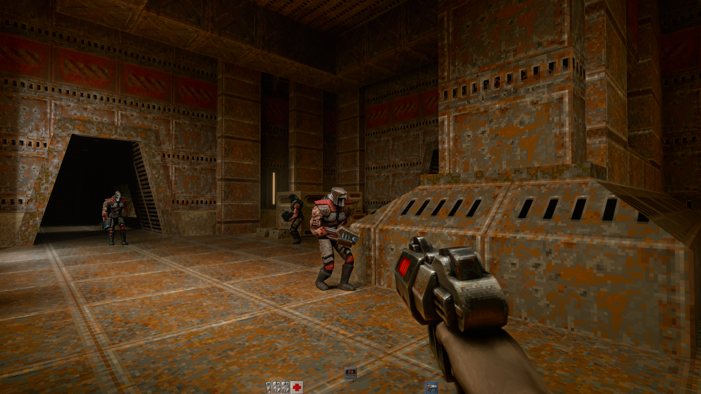
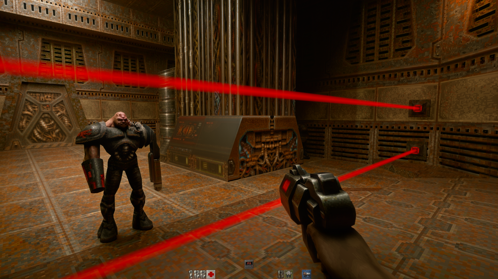
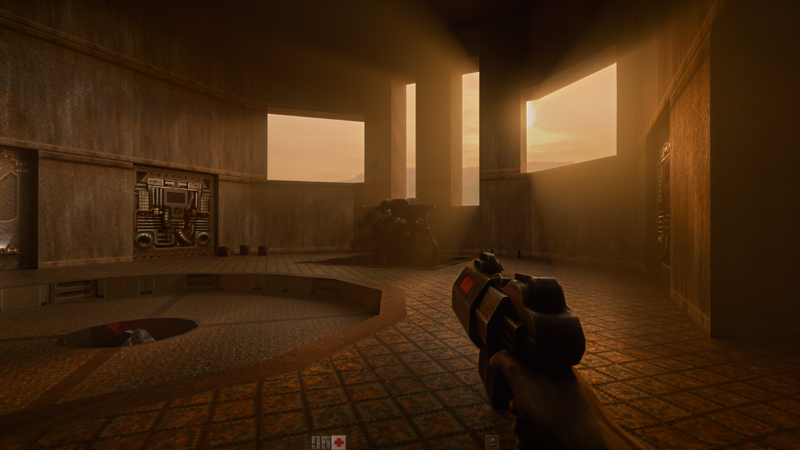

# Tuin Quake II RTX v1.1.0

[Download the latest installer](https://github.com/tuin-boop/TuinQuake2RTX/releases/latest).

## Install and play

Run Tuin-Quake-II-RTX-Setup-v1.1.0.exe, select your owned Quake II folder containing baseq2/pak0.pak, and choose a **new, empty** destination.

- **Remastered models (recommended): on by default.** Needs rerelease/baseq2/pak0.pak from your owned rerelease. Untick for original models.
- **DLSS 5 experimental: off by default.** Normal TuinRTX play works without it.

Open the launcher after installation. Setup creates a desktop shortcut when possible. Installed models and neural rendering can be toggled independently before launching.

Requires Windows x64 and Vulkan ray-tracing hardware. Neural mode additionally needs compatible NVIDIA RTX hardware, drivers and runtimes. The EXE is unsigned. Allow about 3 GB plus temporary extraction space. Model conversion may take several minutes; no separate Python installation is needed.

This edition targets the original Quake II campaign. It does not install the rerelease executable or expansions. The tested import converts 83 models and 111 skins, covering monsters, first-person weapons and pickups. Skeletal poses become MD3 frames at 1/64-unit precision with classic frame/skin indices. Multiplayer bodies and expansion models are excluded. Original maps/gameplay and world textures are retained, with nearest texture sampling.

Normal mode uses TuinRTX path tracing. This optional Quake II integration uses **Feeder**, not the Quake I native-DLSS integration or RTX Remix. Alt+X is not a Remix menu here.

## Optional Chicken / DLSS 5

Instructions checked 7 September 2026. Tested: Chicken 1.4.8-alpha, Feeder 0.14.0-beta.5, ReShade 6.8.0.

### Get the files

- **Deep Fried Chicken by Alexander:** [author's Discord](https://discord.gg/g2v2XGqvR). Extract the download.
- **nvngx_dlssnr.dll:** see the [RenoDX community DLSS5 channel](https://discord.com/invite/renodx), linked by the [Feeder guide](https://github.com/jlrouzies-fr/DLSS5-Feeder#readme). Availability and terms may change.

Prepare one folder:

    deep-fried-chicken.addon64
    deep-fried-chicken-nvngx.dll
    nvngx_dlssnr.dll
    deep-fried-chicken.cfg          (recommended: supplied defaults)

Choose it when enabling the experimental setup option, or use **Add DLSS 5 files…** later in the launcher.

ReShade, Feeder and its Super Resolution runtime are already prepared. Do not run another injector's automatic installer over this copy. Optional import downloads LumeniteFX directly from [its author](https://github.com/umar-afzaal/LumeniteFX), pinned to f8cbbb4eccfcb7adf0d74bb358ba349272e3c1e9. Internet access is needed for this step; failures appear in the status.

Chicken, the neural DLL and LumeniteFX are **not rehosted** in this release. Chicken/NR files must be supplied separately under their own terms. Use only one neural consumer in the game folder.

### Enable it

1. Tick **DLSS 5 neural rendering — experimental** in the launcher.
2. Start with **1 pass**. Options go up to 4; more passes are slower and may look worse.
3. Start the game. The loading screen waits for a game window; neural warm-up can continue afterward.
4. Press **Esc**, then **Ctrl+Home**, and select **Deep Fried Chicken**. Restart if Chicken requests a first-run restart.
5. Check Feeder/Chicken status and logs. The preset runs Lumenite Kernel followed by DLSS5 Feed.
6. Close the game before switching modes. Untick neural rendering for normal play.

The layer is enabled only for this process. No global ReShade registration is created.

## Controls and known limitations

- **F12:** engine screenshots in game/baseq2/screenshots.
- **PrintScreen during neural play:** ReShade captures in Screenshots; the launcher opens this folder.
- **F:** flashlight. **/**: cycle sun.
- Resolution, fullscreen and passes are selectable. Saves/settings stay in this installation.

Check game/deep-fried-chicken.log, game/dlss5-feed.log and game/ReShade.log if the effect seems absent. Feeder uses estimated motion and ReShade depth, not direct native game motion vectors.

Experimental issues include ghosting, smoothing, low FPS, slow startup and **crashes on quitting**. The previous test reproduced an exit crash with beta.5, reported before the model change. Normal mode does not load the neural layer. Error reports may appear as game/Q2RTX_CrashReport*.txt; console logs are under game/baseq2/logs. A requested dump may fail to write.

## Build

Engine source is unchanged from d6a9a486; follow the repository CMake instructions.

Build the converter with Python 3.12:

    python -m venv build/converter-env
    .\build\converter-env\Scripts\python.exe -m pip install numpy==2.3.5 pyinstaller==6.16.0
    .\build\converter-env\Scripts\python.exe -m PyInstaller --noconfirm --onedir --name TuinModelConverter --distpath build/converter-dist --workpath build/converter-work --specpath build Packaging/TuinEdition/Convert-Remaster-Models.py

Package a working TuinRTX runtime, isolated ReShade layer and converter:

    .\Packaging\TuinEdition\Build.ps1 -RuntimePath 'C:\Builds\Q2Runtime' -LayerPath 'C:\Builds\LocalReShade' -ConverterPath 'C:\Builds\TuinModelConverter'
    .\Packaging\TuinEdition\Test-Launcher.ps1 -LauncherPath (Get-Content build/tuin-release/launcher-path.txt)

Inputs include RTX media/configs/shaders, Feeder beta.5 with matching DLSS5_Feed.fx, ReShade headers and nvngx_dlss.dll. ReShade64.json must name VK_LAYER_quake_swapper and use an adjacent DLL. The installer uses an appended ZIP payload, imports owned data and bundles component notices. [Feeder source](https://github.com/jlrouzies-fr/DLSS5-Feeder) · [ReShade source](https://github.com/crosire/reshade).

To add models manually from an installed package:

    .\tools\TuinModelConverter.exe --classic "C:\Games\Quake 2\baseq2\pak0.pak" --remaster "C:\Games\Quake 2\rerelease\baseq2\pak0.pak" --output "game\baseq2\z_remastered_models.pkz"

Otherwise rerun setup into a fresh destination with models selected. Full playthroughs, all animations and every hardware/display combination remain untested. See [validation](VALIDATION.md).

